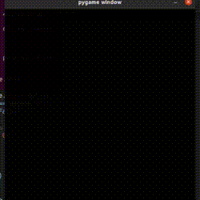

## Maze solver using A*

Simulation of maze solution using the A * algorithm

<p align="center">
    
</p>

### Installing

For the execution of this project it is necessary to install the library [pygame](https://www.pygame.org), we can perform the installation by running the command line below:
```shell
$ pip3 install requirements.txt 
```

### Usage

- Run
```shell
$ python3 solver.py
```